# Adjuvant Therapy for HER2-Positive Breast Cancer: From Standard to Precision

An Evolving Landscape — 2026 Update

<!--
這張投影片要強調：這是一個關於 HER2 陽性乳癌輔助治療的全面回顧，涵蓋從 trastuzumab 到 T-DXd 等新藥的最新進展。提示下一頁：我們先從 HER2 陽性乳癌的基礎開始。
-->

---

# Introduction

<!--
這張投影片要強調：接下來進入介紹部分，了解 HER2 陽性乳癌的基本特徵和治療架構。提示下一頁：先看 HER2 陽性乳癌的概述。
-->

---

## HER2-Positive Breast Cancer Overview

- **HER2+ breast cancer**: ~15–20% of all breast cancers; defined by IHC 3+ or FISH-amplified
- Historically aggressive subtype with poor prognosis before anti-HER2 therapy
- **HER2-targeted agents** have transformed outcomes — 10-year OS now exceeds 80% in early-stage disease
- Key drug classes: monoclonal antibodies (trastuzumab, pertuzumab), ADCs (T-DM1, T-DXd), TKIs (tucatinib, neratinib)
- Treatment decisions guided by **stage at presentation** and **response to neoadjuvant therapy**

> The advent of anti-HER2 therapy has converted one of the most aggressive breast cancer subtypes into one with among the best prognoses — but residual disease and high-risk features remain challenges.

<cite>Slamon DJ et al. NEJM 2001; Swain SM et al. NEJM 2015</cite>

<!--
這張投影片要強調：HER2 陽性乳癌佔所有乳癌的 15-20%，在 anti-HER2 治療出現前預後很差，但如今 10 年 OS（整體存活，Overall Survival）已超過 80%。治療決策取決於分期和對前導性治療的反應。提示下一頁：目前的治療演算法。
-->

---

## Treatment Algorithm for Early HER2+ Breast Cancer

**Low Risk (Stage I, ≤2 cm, N0)**

**Higher Risk (Stage II–III)**

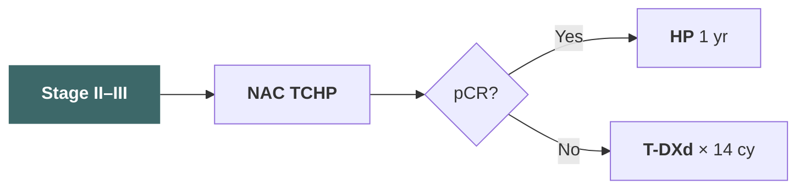

<cite>NCCN Guidelines Breast Cancer v2.2025</cite>

<!--
這張投影片要強調：早期 HER2 陽性乳癌的治療策略依風險分層——低風險用 APT，較高風險先做 TCHP 再依 pCR（病理完全反應，pathological Complete Response）與否決定後續治療。提示下一頁：進入標準輔助治療架構。
-->

---

# Standard Adjuvant Framework

<!--
這張投影片要強調：接下來回顧 HER2 陽性乳癌輔助治療的標準架構，從 trastuzumab 的里程碑開始。提示下一頁：先談 trastuzumab 的基礎地位。
-->

---

## Trastuzumab — The Foundation

- **HERA, NSABP B-31, NCCTG N9831** (2005): adjuvant trastuzumab reduced recurrence by ~50%
- 1 year of trastuzumab became global standard of care
- 10-year DFS improvement: **HR 0.76** (HERA), absolute benefit ~6–8%
- Cardiac toxicity (CHF ~2–4%) requires monitoring
- Shorter durations (6 months) tested but **not non-inferior** to 12 months (PHARE, PERSEPHONE debated)

> Trastuzumab established the proof of concept for HER2-targeted adjuvant therapy and remains the backbone of all regimens.

<cite>Piccart-Gebhart MJ et al. NEJM 2005; Romond EH et al. NEJM 2005</cite>

<!--
這張投影片要強調：Trastuzumab 是 HER2 陽性乳癌輔助治療的基石，2005 年的臨床試驗顯示可降低約 50% 的復發風險。1 年治療是全球標準。提示下一頁：原始圖表。
-->

---

## Trastuzumab — DFS Kaplan-Meier Curve

<cite>Romond EH et al. NEJM 2005 — Figure 2A: Kaplan–Meier Estimates of Disease-Free Survival</cite>

<!--
這張投影片要強調：這是 NSABP B-31 / NCCTG N9831 的原始 DFS（無疾病存活，Disease-Free Survival）Kaplan-Meier 曲線，視覺化呈現 trastuzumab 帶來的顯著獲益。請替換為原始圖片。提示下一頁：加上 pertuzumab 的雙標靶策略。
-->

---

## APHINITY — Adding Pertuzumab

- **Phase III**: pertuzumab + trastuzumab + chemo vs trastuzumab + chemo
- **N = 4,805**; node-positive and high-risk node-negative
- **8.4-yr iDFS**: HR 0.77 (95% CI 0.66–0.91)
- Node-positive subgroup: **absolute iDFS benefit ~4.9%** at 6 yr
- Node-negative: minimal benefit

### Key Takeaways

<!-- prettier-ignore -->
| | Pertuzumab + H | H alone |
|---|---|---|
| 8-yr iDFS (N+) | 87.9% | 83.0% |
| 8-yr iDFS (N−) | 92.8% | 92.5% |
| Diarrhea G3+ | 9.8% | 3.7% |
| Cardiac events | Similar | — |

> Pertuzumab addition benefits primarily node-positive patients; its value in node-negative disease is limited.

<cite>von Minckwitz G et al. NEJM 2017; Piccart M et al. Lancet Oncol 2024</cite>

<!--
這張投影片要強調：APHINITY 試驗證實 pertuzumab 加入 trastuzumab 在淋巴結陽性患者有約 4.9% 的絕對 iDFS（無侵犯性疾病存活，invasive Disease-Free Survival）獲益，但在淋巴結陰性患者幾乎沒有額外好處。提示下一頁：原始圖表。
-->

---

## APHINITY — iDFS in Node-Positive Subgroup

<cite>von Minckwitz G et al. NEJM 2017 — Figure 2B: iDFS in Node-Positive Disease</cite>

<!--
這張投影片要強調：這是 APHINITY 試驗在淋巴結陽性亞群的 iDFS（無侵犯性疾病存活，invasive Disease-Free Survival）Kaplan-Meier 曲線，清楚呈現 pertuzumab 加入後的獲益。請替換為原始圖片。提示下一頁：低風險族群的去強化策略。
-->

---

## APT Trial — De-escalation for Small Tumors

- **Single-arm phase II** (Tolaney et al.): paclitaxel weekly × 12 + trastuzumab × 1 yr
- **N = 406**; tumors ≤3 cm, node-negative
- **7-yr iDFS: 93.3%**; 7-yr OS: 95.0%
- **No anthracycline, no pertuzumab** — excellent outcomes with less toxicity
- Recurrence rate: 2.6% distant, 0.5% locoregional at 7 yr
- Cardiac events: CHF 0.5%, LVEF decline 3.2%

> APT established that stage I HER2+ patients can achieve excellent outcomes with chemotherapy de-escalation, avoiding anthracycline toxicity.

<cite>Tolaney SM et al. JCO 2019; Tolaney SM et al. JCO 2023 (10-yr update)</cite>

<!--
這張投影片要強調：APT 試驗證實小腫瘤、淋巴結陰性的 HER2 陽性乳癌可以用去強化方案（paclitaxel + trastuzumab），7 年 iDFS（無侵犯性疾病存活，invasive Disease-Free Survival）達 93%，避免了 anthracycline 的毒性。提示下一頁：KATHERINE 試驗改變了殘留疾病的處理方式。
-->

---

## NeoSphere — Trial Design

**Inclusion / Patient Characteristics**

- Randomized, open-label, **phase II**
- Treatment-naive women with HER2+ breast cancer
- Operable, locally advanced, or inflammatory
- **N = 417**, randomized 1:1:1:1
- Stratified by disease type & HR status

**Neoadjuvant Arms (4 cycles q3w)**

- **A:** Docetaxel + trastuzumab (TH)
- **B:** Docetaxel + trastuzumab + pertuzumab (THP)
- **C:** Trastuzumab + pertuzumab (HP, no chemo)
- **D:** Docetaxel + pertuzumab (TP)
- Primary endpoint: **pCR** (ypT0/is)

<cite>Gianni L et al. Lancet Oncol 2012 ([DOI](https://doi.org/10.1016/S1470-2045(11)70336-9))</cite>

<!--
這張投影片要強調：NeoSphere 是關鍵的 phase II 試驗，首次在術前治療中評估 pertuzumab 加入 trastuzumab 的療效。四組設計包含無化療組（HP），為雙標靶活性提供了概念驗證。提示下一頁：結果。
-->

---

## NeoSphere — Efficacy

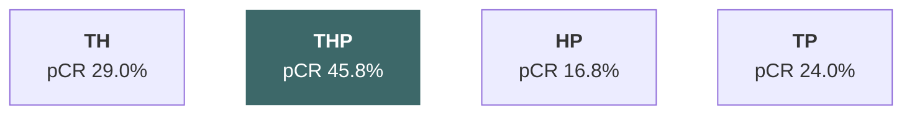

- **THP** achieved the highest pCR — **45.8% vs 29.0%** for TH alone (p=0.014)
- HR− subgroup: pCR nearly doubled with pertuzumab
- Chemo-free arm (HP): pCR 16.8% — proof of concept for anti-HER2 activity alone
- 5-yr DFS/OS: trends favoring THP, but not powered for long-term endpoints

<!--
這張投影片要強調：THP 組達到最高 pCR 率，奠定了雙標靶加化療的基礎。HP 無化療組也有 16.8% pCR，證明雙標靶本身具有抗腫瘤活性。提示下一頁：安全性。
-->

---

## NeoSphere — Safety

- **No significant increase in cardiac toxicity** with dual blockade
- LVEF decline ≥10 pts to <50%: TH 5.6%, THP 4.7%, HP 1.0%, TP 3.8%
- Symptomatic CHF: rare across all arms
- Most common AEs in chemo-containing arms: **neutropenia, febrile neutropenia, diarrhea**
- Chemo-free HP arm: markedly fewer grade ≥3 AEs
- No treatment-related deaths

<cite>Gianni L et al. Lancet Oncol 2012; Gianni L et al. Lancet Oncol 2016 (5-yr update) ([DOI](https://doi.org/10.1016/S1470-2045(15)00133-X))</cite>

<!--
這張投影片要強調：雙標靶（H+P）不會顯著增加心臟毒性。HP 無化療組的嚴重不良事件最少。安全性數據支持將 pertuzumab 加入 trastuzumab 為基礎的術前治療。提示下一頁：TRYPHAENA 試驗。
-->

---

## TRYPHAENA — Trial Design

- **Phase II**, open-label, **N = 225**, HER2+ operable / locally advanced / inflammatory BC
- Primary endpoint: **cardiac safety**

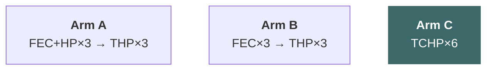

<cite>Schneeweiss A et al. Ann Oncol 2013 ([DOI](https://doi.org/10.1093/annonc/mdt182))</cite>

<!--
這張投影片要強調：TRYPHAENA 是 phase II 試驗，測試三種含 pertuzumab 方案的心臟安全性。Arm C（TCHP）為無 anthracycline 方案。提示下一頁：療效與安全性結果。
-->

---

## TRYPHAENA — Efficacy & Safety

- **pCR (ypT0/is):** Arm A **61.6%**, Arm B **57.3%**, Arm C **66.2%**
- Cardiac events low: LVEF decline ≥10 pts to <50%: A 5.6% / B 5.3% / C **3.9%**
- Symptomatic LVSD: 2.7% (Arm B only)
- Most common AE: **diarrhea**; Arm C had lowest cardiac toxicity
- **TCHP established as a safe, anthracycline-free, platinum-based dual-blockade regimen**

<!--
這張投影片要強調：TRYPHAENA 是承先啟後的樞紐試驗。承先：NeoSphere 證明 THP 可提升 pCR，但未加 carboplatin。TRYPHAENA 證明 TCHP 心臟安全性可接受、pCR 最高（66.2%）、且不需 anthracycline。啟後：KRISTINE 以 TCHP 為標準對照；KATHERINE 處理 TCHP 後殘留病灶。提示下一頁：pCR 原始圖表。
-->

---

## TRYPHAENA — pCR in ITT Population

<cite>Schneeweiss A et al. Ann Oncol 2013 — Pathological complete response in the ITT population</cite>

<!--
這張投影片要強調：ITT 族群的 pCR 率及 95% 信賴區間，分別以 ypT0/is、ypT0/is ypN0、ypT0、ypT0 ypN0 四種定義呈現，並依荷爾蒙受體狀態（ER-/PgR-陽性 vs ER-/PgR-陰性）分組。長條圖內顯示達到 pCR 的確切人數（n/N）。ypT0/is = 乳房無侵襲性殘留腫瘤（允許 DCIS/LCIS）；ypT0/is ypN0 = 乳房及淋巴結均無侵襲性殘留；ypT0 = 乳房無侵襲性及非侵襲性殘留；ypT0 ypN0 = 乳房及淋巴結均無任何殘留。FEC = 5-fluorouracil、epirubicin、cyclophosphamide；H = trastuzumab；P = pertuzumab；T = docetaxel；TCH = docetaxel、carboplatin、trastuzumab。提示下一頁：KRISTINE 試驗。
-->

---

## KRISTINE — Trial Design

**Inclusion / Patient Characteristics**

- Randomized, open-label, **phase III**
- Age ≥18, centrally confirmed HER2+
- Stage II–III, tumor >2 cm, ECOG 0–1
- Baseline LVEF ≥55%
- **N = 444**, stratified by HR, stage, region

**Neoadjuvant Arms (6 cycles q3w)**

- **Arm A:** TCHP (docetaxel, carboplatin, trastuzumab, pertuzumab)
- **Arm B:** T-DM1 + P (trastuzumab emtansine + pertuzumab)
- Primary endpoint: **pCR** (ypT0/is ypN0)

<cite>Hurvitz SA et al. Lancet Oncol 2018 ([DOI](https://doi.org/10.1016/S1470-2045(17)30716-7))</cite>

<!--
這張投影片要強調：KRISTINE 是在術前治療階段比較「化療+雙標靶（TCHP）」與「T-DM1+P（去化療方案）」的隨機 phase III 試驗。收案要求 LVEF ≥55%、ECOG 0-1。目的是測試能否用 ADC 取代傳統化療。提示下一頁：結果。
-->

---

## KRISTINE — Efficacy

- **pCR (ypT0/is ypN0):** TCHP **55.7%** (123/221) vs T-DM1+P **44.4%** (99/223)
- Difference −11.3% (95% CI −20.5 to −2.0; **p=0.016**)
- HR−/HER2+ subgroup: difference −19.0% | HR+/HER2+: −8.6%
- **3-yr EFS:** similar between arms (~90%)

<!--
這張投影片要強調：TCHP 的 pCR 顯著優於 T-DM1+P，ADC 無法取代傳統化療+雙標靶。但長期 EFS 相近，暗示 non-pCR 患者可透過後續治療彌補。提示下一頁：安全性。
-->

---

## KRISTINE — Safety

<!-- prettier-ignore -->
| AE (Grade 3–4) | TCHP (n=219) | T-DM1+P (n=223) |
|---|---|---|
| Any G3–4 AE | **64%** | **13%** |
| Any serious AE | 29% | 5% |
| Neutropenia | 25% | <1% |
| Febrile neutropenia | 15% | 0% |
| Diarrhea | 15% | <1% |
| Thrombocytopenia | 5% | 1% |
| ALT increase | 2% | 1% |

- No treatment-related deaths in either arm
- T-DM1+P had a **markedly better tolerability profile**

<!--
這張投影片要強調：TCHP 的 G3-4 不良事件率（64%）遠高於 T-DM1+P（13%），尤其是嗜中性球低下和發燒性嗜中性球低下。T-DM1+P 雖然 pCR 較低，但耐受性顯著較好。提示下一頁：原始圖表。
-->

---

## KRISTINE — pCR by Subgroup

<cite>Hurvitz SA et al. Lancet Oncol 2018 — Figure 2: Pathological Complete Response</cite>

<!--
這張投影片要強調：KRISTINE 試驗的 pCR 結果圖——整體與 HR 次族群分析均顯示 TCHP 的 pCR 率優於 T-DM1+P。此結果確立了化療+雙標靶仍是術前治療的標準，也為 KATHERINE 試驗中 non-pCR 患者轉用 T-DM1 提供了背景脈絡。提示下一頁：KATHERINE 試驗收案條件。
-->

---

## KATHERINE — Population & Inclusion

**Inclusion Criteria**

- cT1-4 / N0-3 HER2+ breast cancer
- Completed neoadjuvant chemo + **trastuzumab-containing** regimen
- **≥ 6 cycles (≥ 18 weeks)** of taxane ± anthracycline
- **Key criterion:** residual invasive disease at surgery (**non-pCR**)

**Prior anti-HER2 not limited to dual blockade**

- Single-target (e.g. TCH) ✔
- Dual-target (e.g. TCHP) ✔
- Core logic: **residual disease = current regimen insufficient → switch agent**
- Subgroup analysis: benefit consistent regardless of prior H or H+P

<!--
這張投影片要強調：KATHERINE 試驗的收案條件並不強制要求術前使用雙標靶（TCHP），只要含 trastuzumab 即可。次族群分析顯示，無論術前為單標靶或雙標靶，T-DM1 的獲益一致。臨床關鍵在於「有無殘留病灶」，而非術前標靶方案的選擇。提示下一頁：試驗結果。
-->

---

## KATHERINE — Efficacy

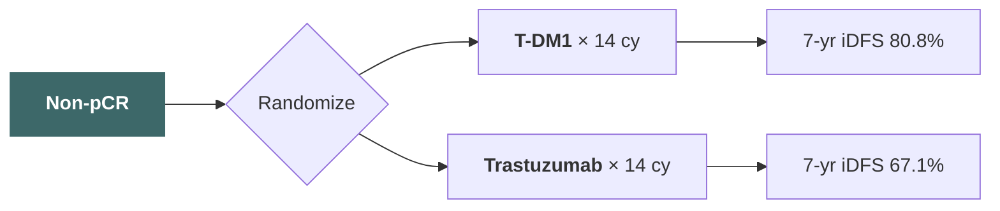

- **N = 1,486**; phase III, open-label
- **3-yr iDFS**: 88.3% vs 77.0% (**HR 0.50**, p<0.001) — initial publication
- **7-yr iDFS**: 80.8% vs 67.1% (**HR 0.54**) — absolute benefit **13.7%**
- HR+ (0.53), HR− (0.56): consistent; CNS recurrence reduced (5.9% vs 8.9%)

<cite>von Minckwitz G et al. NEJM 2019 ([DOI](https://doi.org/10.1056/NEJMoa1814017)); Loibl S et al. JCO 2024 (7-yr update)</cite>

<!--
這張投影片要強調：KATHERINE 是第一個根據前導性治療反應來調整輔助治療的策略。初始發表 HR 0.50，7 年更新 HR 0.54，絕對 iDFS 獲益 13.7%。HR 陽性和 HR 陰性亞群獲益一致。提示下一頁：安全性。
-->

---

## KATHERINE — Safety

<!-- prettier-ignore -->
| AE | T-DM1 (n=740) | Trastuzumab (n=720) |
|---|---|---|
| Any G3+ AE | 25.7% | 15.4% |
| Thrombocytopenia (any) | 29.1% | 2.4% |
| Thrombocytopenia G3+ | 5.7% | 0.3% |
| Peripheral neuropathy | 18.6% | 6.9% |
| AST/ALT elevation | 22.6% / 18.2% | 4.3% / 3.5% |
| Hemorrhage | 29.2% | 10.5% |
| Cardiac (LVEF decline) | 5.8% | 5.3% |

- T-DM1 had more thrombocytopenia, hepatotoxicity, and neuropathy
- No significant increase in cardiac events vs trastuzumab alone
- Discontinuation due to AE: T-DM1 18% vs trastuzumab 2.1%

<!--
這張投影片要強調：T-DM1 的主要不良反應為血小板低下、肝毒性和周邊神經病變，但心臟毒性未顯著增加。停藥率 T-DM1 為 18%，顯著高於 trastuzumab。提示下一頁：原始圖表。
-->

---

## KATHERINE — iDFS Kaplan-Meier Curve

<cite>von Minckwitz G et al. NEJM 2019 — Figure 1A: Invasive Disease–Free Survival (ITT Population)</cite>

<!--
這張投影片要強調：這是 KATHERINE 試驗的原始 iDFS Kaplan-Meier 曲線，視覺化呈現 T-DM1 相較於 trastuzumab 的顯著獲益。提示下一頁：進入 DESTINY-Breast05。
-->

---

# DESTINY-Breast05

<!--
這張投影片要強調：DESTINY-Breast05 是近年來 HER2 陽性乳癌輔助治療最重要的突破性試驗。提示下一頁：先看試驗設計。
-->

---

## DESTINY-Breast05 — Inclusion Criteria

**HER2 Confirmation & Prior Therapy**

- Centrally confirmed HER2+ (IHC 3+ or ISH+, per 2018 ASCO-CAP)
- Completed neoadjuvant: **≥9 wk taxane-based chemo + ≥9 wk trastuzumab** (± pertuzumab)
- ECOG PS 0–1
- **≤12 weeks** from last surgery to randomization
- **N = 1,453** — the largest post-neoadjuvant HER2+ trial

**High-Risk Residual Disease**

- **Inoperable at presentation:** cT4N0-3M0 or cT1-3N2-3M0
- **Operable at presentation:** cT1-3N0-1M0, but with **ypN1-3** (node-positive after NAC)
- All patients: residual invasive disease in breast or axilla

<cite>Curigliano G et al. NEJM 2025</cite>

<!--
這張投影片要強調：DB-05 的收案條件非常精確——需要中央確認 HER2 陽性、完成至少 9 週 taxane 化療和 9 週 trastuzumab、ECOG 0-1、且手術後 12 週內隨機分組。高風險定義包括初始無法手術的患者和術前治療後仍有淋巴結陽性的患者。提示下一頁：試驗設計圖。
-->

---

## DESTINY-Breast05 — Trial Design

- **Phase III, randomized, open-label, international**
- **T-DXd** (5.4 mg/kg q3w × 14 cy) vs **T-DM1** (3.6 mg/kg q3w × 14 cy)
- Stratification: HR status, prior pertuzumab, nodal status at surgery, region
- **Primary endpoint**: iDFS
- Key secondary: OS, iDFS in HR+/HR− subgroups, safety

<cite>Curigliano G et al. NEJM 2025</cite>

<!--
這張投影片要強調：DB-05 是第一個在 KATHERINE 建立的 non-pCR 標準上直接挑戰 T-DM1 的隨機 phase III 試驗。提示下一頁：試驗設計圖。
-->

---

## DESTINY-Breast05 — Trial Schema

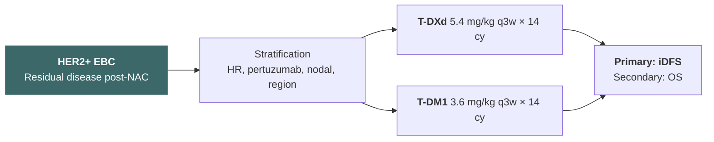

<cite>Curigliano G et al. NEJM 2025</cite>

<!--
這張投影片要強調：DB-05 的試驗設計圖——殘留疾病患者經分層後隨機分配到 T-DXd 或 T-DM1，主要終點為 iDFS（無侵犯性疾病存活，invasive Disease-Free Survival）。提示下一頁：關鍵結果。
-->

---

## DESTINY-Breast05 — Key Efficacy Results

### Primary Endpoint: iDFS

- **T-DXd**: 3-yr iDFS **90.6%**
- **T-DM1**: 3-yr iDFS **80.3%**
- **HR 0.47** (95% CI 0.35–0.63; p < 0.001)
- **Absolute benefit: 10.3%** at 3 yr
- Events: T-DXd 54/732 vs T-DM1 106/721

### Recurrence Patterns

<!-- prettier-ignore -->
| Event Type | T-DXd | T-DM1 |
|---|---|---|
| Distant recurrence | 5.3% | 12.1% |
| Locoregional | 1.0% | 1.9% |
| CNS as first event | 1.5% | 3.5% |
| Contralateral BC | 0.4% | 0.7% |
| Death without recurrence | 0.3% | 0.6% |

> T-DXd reduced the risk of iDFS events by 53% compared to T-DM1 — the largest improvement seen in adjuvant HER2+ trials since trastuzumab itself.

<cite>Curigliano G et al. NEJM 2025</cite>

<!--
這張投影片要強調：DB-05 的核心結果——T-DXd 相較於 T-DM1，3 年 iDFS（無侵犯性疾病存活，invasive Disease-Free Survival）從 80.3% 提升到 90.6%，HR（風險比，Hazard Ratio）0.47，絕對獲益超過 10%。遠端復發從 12.1% 降到 5.3%，CNS（中樞神經系統）復發也明顯減少。提示下一頁：原始圖表。
-->

---

## DESTINY-Breast05 — iDFS Kaplan-Meier Curve

<cite>Curigliano G et al. NEJM 2025</cite>

<!--
這張投影片要強調：這是 DB-05 的 iDFS（無侵犯性疾病存活，invasive Disease-Free Survival）Kaplan-Meier 曲線。請替換為原始圖片。提示下一頁：亞族群分析。
-->

---

## DESTINY-Breast05 — Subgroup Analysis

### Consistent Benefit Across Subgroups

- **HR-positive**: HR 0.47 (0.32–0.69)
- **HR-negative**: HR 0.48 (0.30–0.78)
- **Prior pertuzumab**: HR 0.50 (0.36–0.70)
- **No prior pertuzumab**: HR 0.37 (0.20–0.68)
- **ypN0 (node-negative at surgery)**: HR 0.43
- **ypN+ (node-positive at surgery)**: HR 0.49

### Notable Observations

- Benefit seen regardless of HR status
- Patients who had received pertuzumab still benefited
- Residual nodal disease — a poor prognostic group — showed robust benefit
- No subgroup showed a signal favoring T-DM1
- OS data immature but trending favorably

> T-DXd superiority was consistent across all pre-specified subgroups — no identifiable population that should preferentially receive T-DM1.

<cite>Curigliano G et al. NEJM 2025</cite>

<!--
這張投影片要強調：亞族群分析顯示 T-DXd 的獲益在所有預設的亞族群中一致，包括 HR 陽性/陰性、有無使用過 pertuzumab、殘留淋巴結狀態。沒有任何亞族群顯示 T-DM1 較優。提示下一頁：原始圖表。
-->

---

## DESTINY-Breast05 — Forest Plot

<cite>Curigliano G et al. NEJM 2025</cite>

<!--
這張投影片要強調：這是 DB-05 的亞族群分析森林圖，顯示所有亞群一致受益。請替換為原始圖片。提示下一頁：安全性。
-->

---

## DESTINY-Breast05 — Safety Profile

<!-- prettier-ignore -->
| AE | T-DXd | T-DM1 |
|---|---|---|
| Nausea (any grade) | 73% | 41% |
| Alopecia | 36% | 5% |
| Fatigue | 41% | 30% |
| Neutropenia G3+ | 11% | 3% |
| Thrombocytopenia G3+ | 3% | 8% |
| **ILD/pneumonitis** (any) | **12.4%** | 1.7% |
| ILD/pneumonitis G3+ | 0.7% | 0.3% |
| Treatment discontinuation | 17% | 10% |

> T-DXd has a distinct toxicity profile vs T-DM1 — more nausea and ILD risk, less thrombocytopenia.

<cite>Curigliano G et al. NEJM 2025</cite>

<!--
這張投影片要強調：T-DXd 的安全性特徵與 T-DM1 不同——更多噁心、脫髮和嗜中性球低下，但血小板低下較少。ILD（間質性肺病，Interstitial Lung Disease）是最需要關注的不良反應。提示下一頁：ILD 的詳細討論。
-->

---

## DESTINY-Breast05 — Interstitial Lung Disease (ILD)

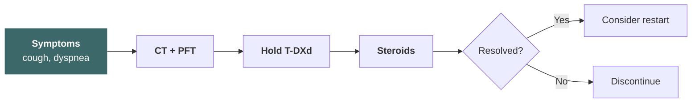

- **12.4%** any-grade (mostly G1–G2); **no G5 (fatal) events** in DB-05
- Median onset ~5 months; discontinuation due to ILD ~5%

> ILD is manageable with proactive monitoring — no fatal events in DB-05, but vigilance is essential.

<cite>Curigliano G et al. NEJM 2025</cite>

<!--
這張投影片要強調：ILD（間質性肺病，Interstitial Lung Disease）發生率 12.4% 但多為 G1-G2，DB-05 中沒有致死性 ILD。中位發生時間約 5 個月，大多數以類固醇和停藥處理後可改善。在輔助治療中需要積極監測但可控。提示下一頁：FDA（美國食品藥物管理局）狀態。
-->

---

## DESTINY-Breast05 — FDA Status & Clinical Impact

- **FDA Priority Review** granted; anticipated approval in 2025
- If approved: T-DXd replaces T-DM1 as standard for **non-pCR after neoadjuvant therapy**
- **Key practice changes**:
  - New standard for post-neoadjuvant residual disease
  - ILD monitoring protocols needed in adjuvant clinics
  - Anti-emetic prophylaxis (moderate emetogenic potential)
  - Patient education about ILD symptoms

> DB-05 represents the most impactful change in adjuvant HER2+ breast cancer management since KATHERINE — T-DXd is poised to become the new standard.

<cite>Curigliano G et al. NEJM 2025</cite>

<!--
這張投影片要強調：DB-05 獲得 FDA（美國食品藥物管理局）優先審查，預計 T-DXd 將取代 T-DM1 成為 non-pCR（病理完全反應，pathological Complete Response）患者的新標準。臨床實務需要建立 ILD（間質性肺病，Interstitial Lung Disease）監測和止吐方案。提示下一頁：FDA 時間軸。
-->

---

## DESTINY-Breast05 — Open Questions

- Long-term **OS benefit**?
- Optimal management of **T-DXd–related ILD** in curative setting?
- Can T-DXd replace T-DM1 + additional agents in **ultra-high-risk** patients?
- **Sequencing** with other HER2 agents after T-DXd exposure?

> These unresolved questions will shape the next generation of adjuvant HER2+ trials.

<cite>Curigliano G et al. NEJM 2025</cite>

<!--
這張投影片要強調：DB-05 仍有幾個關鍵待解問題——長期 OS（整體存活，Overall Survival）、ILD（間質性肺病，Interstitial Lung Disease）管理、超高風險患者的策略、以及 T-DXd 之後的治療序列。提示下一頁：進入 DESTINY-Breast11。
-->

---

## TKI Landscape in HER2+ Breast Cancer

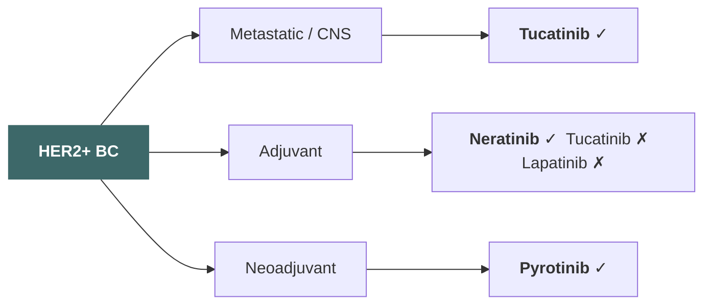

- Adjuvant: only **neratinib** works (HR+, ≤1 yr from H)
- Metastatic ≠ adjuvant (CompassHER2: tucatinib futility)

<!--
這張投影片要強調：TKI 在輔助治療中只有 neratinib 有正面證據。轉移性療效不等於輔助治療獲益。提示下一頁：Neratinib 和去強化策略。
-->

---

# Neratinib & De-escalation

<!--
這張投影片要強調：這一章討論 neratinib 在延伸輔助治療的角色以及生物標記導向的去強化策略。提示下一頁：ExteNET 試驗。
-->

---

## ExteNET — Trial Design

**Inclusion / Patient Characteristics**

- Randomized, double-blind, **phase III**
- Women ≥18 yr, stage 1–3 HER2+ BC
- Completed neoadjuvant/adjuvant trastuzumab ≤2 yr before enrollment
- **N = 2,840** at 495 centers globally

**Treatment Arms (12 months)**

- **Neratinib** 240 mg/day PO × 1 yr
- **Placebo** × 1 yr
- Stratified by HR status, nodal status, prior trastuzumab regimen
- Primary endpoint: **iDFS**

<cite>Martin M et al. Lancet Oncol 2017 ([DOI](https://doi.org/10.1016/S1470-2045(16)30632-3))</cite>

<!--
這張投影片要強調：ExteNET 是大型隨機雙盲 phase III 試驗，納入 2,840 位完成 trastuzumab 輔助治療的 HER2 陽性乳癌患者，測試 neratinib 延伸輔助治療 1 年的效果。提示下一頁：療效。
-->

---

## ExteNET — Efficacy

<!-- prettier-ignore -->
| Subgroup | 5-yr iDFS benefit | HR (95% CI) | 8-yr OS benefit |
|---|---|---|---|
| **Overall** | 3.4% | 0.78 (0.64–0.96) | NS |
| **HR+** | 5.1% | 0.49 (0.31–0.75) | NS |
| **HR−** | NS | 0.93 (0.60–1.43) | NS |
| **Node-positive** | — | 0.60 (0.42–0.85) | — |
| **HR+, residual disease post-NAC** | **7.4%** | — | **9.1%** |
| **HR+, ≤1 yr from H** | 5.1% | — | 2.1% |

- **Best candidates**: HR+, node-positive, residual disease after NAC, started ≤1 yr from trastuzumab
- 8-yr OS in overall population: **not significantly different**

<cite>Chan A et al. JAMA Oncol 2021; Saura C et al. Clin Breast Cancer 2020</cite>

<!--
這張投影片要強調：ExteNET 的獲益高度集中於特定亞群——HR 陽性、淋巴結陽性、術前治療後有殘留病灶、且在 trastuzumab 結束 1 年內開始治療的患者。其中 HR+/殘留病灶亞群的 8 年 OS 獲益高達 9.1%。整體族群的 OS 無顯著差異。提示下一頁：原始圖表。
-->

---

## ExteNET — iDFS by Subgroup (Forest Plot)

<cite>Chan A et al. JAMA Oncol 2021 — Figure 2: Invasive Disease-Free Survival at 8 Years by Subgroups</cite>

<!--
這張投影片要強調：這是 ExteNET 8 年更新的亞族群森林圖，清楚呈現 HR 陽性族群的顯著獲益。請替換為原始圖片。提示下一頁：ExteNET 臨床應用。
-->

---

## ExteNET — Safety & Clinical Application

- **Diarrhea** (any): 95% vs 35% placebo; **G3+**: ~40% → **~17% with loperamide prophylaxis**
- Nausea 43%, vomiting 26%, fatigue 27%
- Discontinuation due to AE: **27%** vs 3%

**Patient Selection**

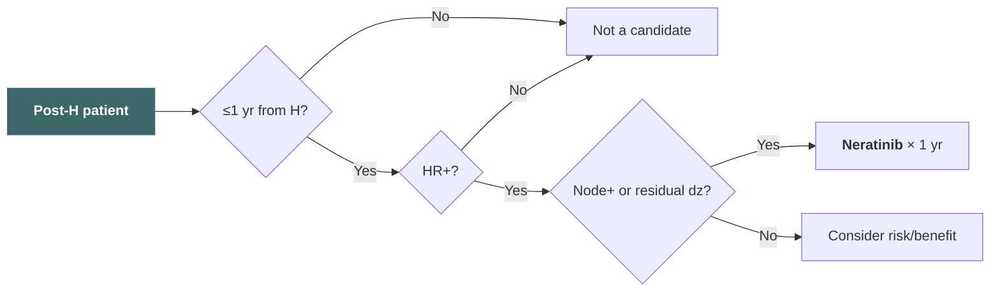

<cite>Chan A et al. JAMA Oncol 2021</cite>

<!--
這張投影片要強調：Neratinib 最主要的不良反應是腹瀉，G3 以上達 40%（無預防時），但使用 loperamide 預防可降至 17%。停藥率 27%，遠高於安慰劑。臨床上需嚴格篩選 HR+ 且在 trastuzumab 結束 1 年內的患者。提示下一頁：機轉討論。
-->

---

## ExteNET — Why HR+ Benefits More & Why Timing Matters

**HR+ subgroup: synergistic blockade**

- HER2 and ER pathways are not independent — **bidirectional crosstalk** enables escape
- When trastuzumab suppresses HER2, HR+ cells upregulate ER signaling to survive
- Neratinib (irreversible pan-HER TKI) + endocrine therapy = **dual pathway shutdown**
- In HR− patients, residual cells may harbor non-HER2 escape mutations → lower marginal benefit

**Earlier start = greater benefit**

- Adjuvant goal: eradicate **minimal residual disease (MRD)** before it evolves
- Within 1 yr of completing trastuzumab: residual cells are still weakened and few → neratinib delivers the "finishing blow"
- Delayed start: residual cells may proliferate and acquire new resistance mechanisms
- HER2+ recurrence peaks at **years 2–3** — early treatment intercepts this high-risk window

- **Key data point**: HR+ patients starting within 1 yr — 5-yr absolute iDFS benefit **≥ 7.4%**

<!--
這張投影片要強調：ExteNET 中 HR+ 亞群獲益最大的原因是 neratinib 阻斷了 ER/HER2 之間的交互代償（crosstalk），與內分泌治療產生協同效應。早期開始治療（< 1 年）的獲益更大，因為微小殘留病灶（MRD）在 trastuzumab 停藥後尚未完全恢復，是清除的最佳時機。HER2+ 乳癌復發高峰在診斷後 2-3 年，越接近此窗口給藥，攔截效果越好。提示下一頁：生物標記導向的去強化策略。
-->

---

## Biomarker-Guided Approaches — Current Tools

- **pCR** after neoadjuvant: strongest prognostic biomarker
- **HR status**: determines benefit from neratinib, pertuzumab
- **Residual cancer burden (RCB)**:
  - RCB-0 (pCR): excellent prognosis
  - RCB-I: near-pCR, consider de-escalation
  - RCB-II/III: high risk, intensification needed
- **ctDNA** (circulating tumor DNA): emerging for MRD detection
- **HER2DX**: genomic assay predicting pCR and survival

> Multiple biomarkers are now available — the challenge is integrating them into actionable treatment algorithms.

<cite>Symmans WF et al. JCO 2017; Prat A et al. Lancet Oncol 2023</cite>

<!--
這張投影片要強調：目前可用的生物標記包括 pCR（病理完全反應，pathological Complete Response）、RCB（殘留癌症負荷，Residual Cancer Burden）、ctDNA（循環腫瘤 DNA）和 HER2DX，各自提供不同維度的預後資訊。提示下一頁：如何將生物標記整合到精準去強化策略。
-->

---

## Biomarker-Guided Approaches — Precision De-escalation

| Risk Level   | Biomarker Signature        | Strategy                     |
| ------------ | -------------------------- | ---------------------------- |
| Very low     | Stage I, RCB-0             | APT, consider no pertuzumab  |
| Low          | pCR after standard NAC     | HP completion, no escalation |
| Intermediate | RCB-I, ctDNA negative      | Surveillance vs maintenance  |
| High         | RCB-II/III, ctDNA positive | T-DXd (DB-05), consider TKI  |

- Future: **multi-omic integration** (genomics + ctDNA + imaging)
- Goal: match treatment intensity to individual risk

> The future of HER2+ adjuvant therapy lies in biomarker-guided precision — escalating for high-risk and de-escalating for favorable biology.

<cite>Symmans WF et al. JCO 2017; Prat A et al. Lancet Oncol 2023</cite>

<!--
這張投影片要強調：將生物標記整合到風險分層中，精準地決定誰需要更強的治療、誰可以安全地減量。未來方向是多體學整合。提示下一頁：生物標記決策樹。
-->

---

## Biomarker-Guided Decision Tree

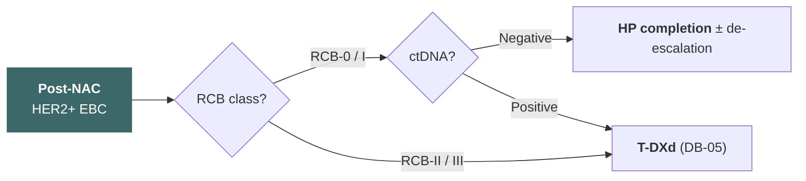

<cite>Symmans WF et al. JCO 2017; Prat A et al. Lancet Oncol 2023</cite>

<!--
這張投影片要強調：用 RCB（殘留癌症負荷，Residual Cancer Burden）和 ctDNA（循環腫瘤 DNA）建立決策樹——RCB-0/I 且 ctDNA 陰性可考慮去強化，RCB-II/III 或 ctDNA 陽性則需要 T-DXd 強化治療。提示下一頁：進入總結。
-->

---

# Summary & Q&A

<!--
這張投影片要強調：最後總結 HER2 陽性乳癌輔助治療的重要進展和未來方向。提示下一頁：關鍵要點。
-->

---

## Key Takeaways

### Established Standards

1. **Trastuzumab × 1 yr** remains the backbone
2. **Pertuzumab** adds benefit in **node-positive** disease (APHINITY)
3. **APT** enables safe de-escalation for stage I
4. **KATHERINE**: T-DM1 for non-pCR — 13.7% absolute iDFS benefit

### Practice-Changing Updates

5. **DESTINY-Breast05**: T-DXd > T-DM1 for non-pCR (HR 0.47, iDFS 90.6% vs 80.3%) — **new standard**
6. **Biomarker-guided** approaches (RCB, ctDNA, HER2DX) are reshaping risk stratification

> We are moving from a one-size-fits-all approach to precision-guided adjuvant therapy — escalating for high-risk and de-escalating for favorable-biology patients.

<cite>Curigliano G et al. NEJM 2025; von Minckwitz G et al. NEJM 2019; Tolaney SM et al. JCO 2019</cite>

<!--
這張投影片要強調：重點回顧——標準架構仍以 trastuzumab 為基礎，APHINITY 和 KATHERINE 各有其角色。DB-05 是最大突破，T-DXd 將成為 non-pCR（病理完全反應，pathological Complete Response）新標準。生物標記將引導未來的精準去強化。提示下一頁：整合治療演算法。
-->

---

## Updated Treatment Algorithm — 2025+

**Low Risk (Stage I, N0)**

**Higher Risk (Stage II–III)**

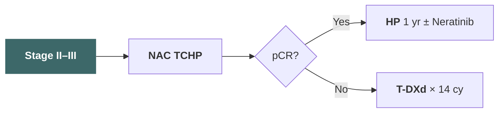

<cite>NCCN Guidelines v2.2025; Curigliano G et al. NEJM 2025</cite>

<!--
這張投影片要強調：整合整場演講的治療決策路徑——低風險用 APT，較高風險做 TCHP 後依 pCR（病理完全反應，pathological Complete Response）決定 HP 或 T-DXd。提示下一頁：感謝與 Q&A。
-->

---

# Clinical Tips

<!--
這張投影片要強調：從循證醫學轉向臨床實務——接下來幾頁整理 T-DM1 和 T-DXd 的劑量、監測、止吐和 ILD（間質性肺病，Interstitial Lung Disease）管理要點，作為臨床實用參考。提示下一頁：T-DM1 劑量與監測。
-->

---

## T-DM1 (Kadcyla) — Dosing & Monitoring

### Dosing

<!-- prettier-ignore -->
| | |
|---|---|
| **Starting dose** | 3.6 mg/kg IV q21d |
| MBC | Continue until progression |
| EBC | 14 cycles total |
| **Dose reduction** | No re-escalation |
| 1st reduction | 3.0 mg/kg |
| 2nd reduction | 2.4 mg/kg |
| Further needed | **Permanently discontinue** |

### Key Monitoring After First Dose (Day 7–10)

<!-- prettier-ignore -->
| Parameter | Details |
|---|---|
| **Platelets** | Most common G≥3 toxicity (5.7–12.9%); nadir ~Day 8, recovers by Day 21. **Asian patients higher risk** (G≥3 TCP 51.4% vs 23.1%) |
| **AST/ALT** | Peaks ~Day 8, self-resolves by Day 21 (any grade: AST 28%, ALT 23%) |
| **Bilirubin** | Monitor concurrently |
| **LVEF** | Baseline + periodic echo (hold if <45%) |

<cite>KADCYLA FDA label 2026; Verma S et al. NEJM 2012; Wuerstlein R et al. JCO 2021</cite>

<!--
這張投影片要強調：T-DM1 起始劑量 3.6 mg/kg，EBC（早期乳癌，Early Breast Cancer）共 14 cycles。血小板是最常見嚴重毒性，亞洲族群發生率明顯更高。Day 7-10 是關鍵監測時間窗。提示下一頁：T-DM1 劑量調整。
-->

---

## T-DM1 — Dose Adjustment Summary

<!-- prettier-ignore -->
| Toxicity | Grade | Action |
|---|---|---|
| Thrombocytopenia | Grade 3 (25–50K) | Hold until ≥75K → resume same dose; if delayed ×2, consider dose reduction |
| Thrombocytopenia | Grade 4 (<25K) | Hold until ≥75K → reduce one level |
| AST/ALT elevation | Grade 3 (>5–20× ULN) | Hold until ≤Grade 2 → reduce one level |
| AST/ALT elevation | Grade 4 (>20× ULN) | **Permanently discontinue** |
| LVEF decline | <45% | Hold, recheck in 3 wk; if still <45% → **discontinue** |
| ILD/Pneumonitis | Any grade | **Permanently discontinue** |
| Peripheral neuropathy | Grade 3–4 | Hold until ≤Grade 2 |

<cite>KADCYLA FDA label 2026</cite>

<!--
這張投影片要強調：T-DM1 劑量調整要點——血小板 Grade 4 需減量，肝功能 Grade 4 和 ILD（間質性肺病，Interstitial Lung Disease）任何等級都要永久停藥，LVEF（左心室射出分率）< 45% 也需要暫停並確認。提示下一頁：T-DXd 劑量與監測。
-->

---

## T-DXd (Enhertu) — Dosing

<!-- prettier-ignore -->
| | |
|---|---|
| **Starting dose** | 5.4 mg/kg IV q21d (breast/NSCLC/IHC 3+ solid tumors); 6.4 mg/kg for gastric |
| **Dose reduction** | No re-escalation |
| 1st reduction | 4.4 mg/kg |
| 2nd reduction | 3.2 mg/kg |
| Further needed | **Permanently discontinue** |
| **Packaging** | 100 mg/vial; e.g., 50 kg = 270 mg (3 vials), 60 kg = 324 mg (4 vials) |
| **Infusion** | 1st: 90 min; subsequent: 30 min if tolerated |

<cite>Enhertu FDA label 2025</cite>

<!--
這張投影片要強調：T-DXd 起始劑量 5.4 mg/kg，每 21 天一次。劑量調整只能往下不能回升。注意包裝為每瓶 100 mg，實務上需依體重計算瓶數。提示下一頁：T-DXd 監測重點。
-->

---

## T-DXd (Enhertu) — Key Monitoring After First Dose

<!-- prettier-ignore -->
| Parameter | Details |
|---|---|
| **Nausea/Vomiting** | Most common AE — **74.6% nausea, 41.6% vomiting**, mostly within first 21 days of Cycle 1 |
| **ANC** | Grade 3–4 neutropenia ~34.6%; nadir Day 7–14 |
| **ILD/Pneumonitis** | Incidence ~11–15%; median onset ~5–6 mo (can occur as early as first 5 cycles). Assess respiratory symptoms + pulse oximetry **at every visit** |
| **LVEF** | Lower cardiac risk, but still require baseline + periodic monitoring |

> Unlike T-DM1, the dominant early toxicity of T-DXd is **nausea** (not thrombocytopenia). Proactive antiemetic prophylaxis is essential from Cycle 1.

<cite>Park YH et al. Oncologist 2025; D'Arienzo A et al. EClinicalMedicine 2023</cite>

<!--
這張投影片要強調：T-DXd 最需要注意的早期毒性是噁心嘔吐（發生率極高），而非血小板低下。ILD（間質性肺病，Interstitial Lung Disease）雖然發生時間較晚但可致命，每次回診都要評估呼吸症狀。提示下一頁：T-DXd 劑量調整。
-->

---

## T-DXd — Dose Adjustment Summary

<!-- prettier-ignore -->
| Toxicity | Grade | Action |
|---|---|---|
| ILD/Pneumonitis | Grade 1 (asymptomatic) | Hold; resolves ≤28 d → same dose; >28 d → reduce one level. Consider steroids ≥0.5 mg/kg/d prednisolone |
| ILD/Pneumonitis | **Grade ≥2 (symptomatic)** | **Permanently discontinue**. Start prednisolone ≥1 mg/kg/d ×14 d, then taper ≥4 wk |
| Neutropenia | Grade 3 (ANC 0.5–1.0) | Hold until ≤Grade 2 → resume same dose |
| Neutropenia | Grade 4 (ANC <0.5) | Hold until ≤Grade 2 → reduce one level |
| Febrile neutropenia | ANC <1.0 + fever | Hold until resolved → reduce one level |
| Thrombocytopenia | Grade 4 (<25K) | Hold until ≤Grade 1 → reduce one level |

> **Critical**: ILD Grade ≥2 = permanent discontinuation. There is no dose reduction — only stop.

<cite>Enhertu FDA label 2025</cite>

<!--
這張投影片要強調：T-DXd 最關鍵的劑量調整是 ILD（間質性肺病，Interstitial Lung Disease）——Grade 1 可暫停觀察，Grade 2 以上必須永久停藥並立即給類固醇。這是和 T-DM1 最大的不同之處。提示下一頁：T-DXd 止吐方案。
-->

---

## T-DXd — Antiemetic Regimen (Day 1)

NCCN 2026 now classifies **T-DXd as High Emetic Risk (>90%)**.

### Preferred 4-Drug Regimen — Day 1 (Pre-chemotherapy)

<!-- prettier-ignore -->
| Drug | Dose |
|---|---|
| **Olanzapine** | 2.5–10 mg PO at bedtime |
| **NK1 RA** (choose one) | Aprepitant 125 mg PO / Fosaprepitant 150 mg IV / Netupitant-Palonosetron combo |
| **5-HT3 RA** (choose one) | Palonosetron 0.25 mg IV / Ondansetron 16–24 mg PO or 8–16 mg IV / Granisetron |
| **Dexamethasone** | 12 mg PO/IV |

> At minimum, all T-DXd patients should receive a **3-drug regimen** (NK1 RA + 5-HT3 RA + dexamethasone).

<cite>NCCN Antiemesis v1.2026</cite>

<!--
這張投影片要強調：T-DXd 已被歸類為高致吐風險，NCCN 首選四藥方案包含 olanzapine + NK1 RA（NK1 受體拮抗劑）+ 5-HT3 RA（血清素受體拮抗劑）+ dexamethasone。至少要用三藥方案。提示下一頁：延遲性止吐與實證。
-->

---

## T-DXd — Antiemetic Regimen (Days 2–4) & Evidence

### Days 2–4

<!-- prettier-ignore -->
| Drug | Dose |
|---|---|
| Olanzapine | 2.5–10 mg PO at bedtime |
| Aprepitant | 80 mg PO Days 2–3 (if PO aprepitant on Day 1) |
| ± Dexamethasone | 8 mg PO/IV |

### Supporting Evidence

- **ERICA trial** (Japan RCT): olanzapine 5 mg ×6 d + 5-HT3 RA + dexamethasone significantly improved delayed nausea CR (**70% vs 56%**)
- **Italian expert consensus**: all T-DXd patients should receive **at least NK1 RA + 5-HT3 RA + dexamethasone** (3-drug regimen)

> Delayed nausea is the predominant pattern with T-DXd — Days 2–4 prophylaxis is critical, not optional.

<cite>Sakai H et al. Ann Oncol 2025; Bianchini G et al. Future Oncol 2025</cite>

<!--
這張投影片要強調：T-DXd 的延遲性噁心是主要問題，Days 2-4 的止吐不能省略。ERICA 研究支持 olanzapine 的加入，義大利共識也建議至少三藥方案。提示下一頁：ILD（間質性肺病，Interstitial Lung Disease）監測實務。
-->

---

## ILD Monitoring — Practical Workflow

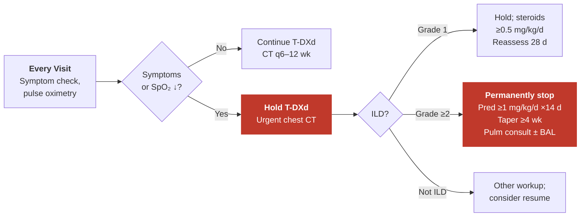

> **Baseline chest CT is mandatory** before starting T-DXd. Maintain a low threshold for imaging if any respiratory symptoms develop.

<cite>Enhertu FDA label 2025; Kish J et al. JCO 2022; Moy B et al. JCO Oncol Pract 2023</cite>

<!--
這張投影片要強調：ILD（間質性肺病，Interstitial Lung Disease）監測流程——每次回診都要做症狀評估和 pulse oximetry，有症狀立即停藥做 CT。基線胸部 CT 是必須的。Grade 2 以上永久停藥並啟動高劑量類固醇。提示下一頁：感謝與 Q&A。
-->

---
layout: center
---

## Thank You & Q&A

Questions & Discussion

<!--
這張投影片要強調：感謝大家的聆聽，歡迎提問和討論。可以針對任何特定試驗或臨床情境進行深入探討。
-->
