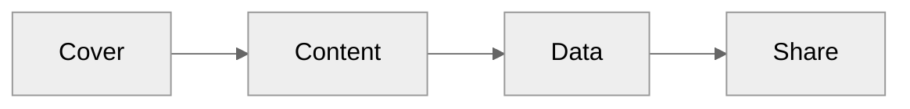

# My Slidev Template

A minimal topic-neutral deck that demonstrates the template features.

---

# Basics

---

## Content Patterns

- <Presentation size="1em" /> **Cover and chapter layouts** keep the deck structure visible
- <Layers size="1em" /> **Top navigation** is generated from `h1` section slides
- <ListChecks size="1em" /> **Bold list keywords** receive the template badge treatment
- <Table2 size="1em" /> **Tables and callouts** use compact, high-contrast styling
- <Image size="1em" /> **Images and citations** keep visual material grounded

> This slide demonstrates icon badges, list styling, the bottom progress bar, and a callout block.

<cite>Template demo citation</cite>

---

## Tables, Images, and Diagrams

| Feature | Demo                   |
| ------- | ---------------------- |
| Table   | Compact rows           |
| Image   | Aspect ratio preserved |
| Mermaid | Centered diagram       |

---

### Breadcrumb Example

This `h3` slide follows an `h2` slide, so the top overlay shows the parent heading for context.

<v-clicks>

- First reveal
- Second reveal
- Third reveal

</v-clicks>

---

# Data

---

## Trial Protocol

<cite>Source: public/drawio/trial-protocol.drawio</cite>

---

## Flow Chart Template

<cite>Source: public/drawio/flow-chart-template.drawio</cite>

---

## Bar and Line Charts

<ChartBar
  :labels="['One', 'Two', 'Three']"
  :datasets="[{ label: 'Demo', data: [12, 19, 8] }]"
  title="Bar"
/>

<ChartLine
  :labels="['Q1', 'Q2', 'Q3', 'Q4']"
  :datasets="[{ label: 'Demo', data: [4, 9, 7, 12], fill: true }]"
  title="Line"
/>

---

## Pie, Doughnut, and Radar Charts

<ChartPie
  :labels="['A', 'B', 'C']"
  :data="[45, 30, 25]"
  title="Pie"
/>

<ChartDoughnut
  :labels="['Build', 'Review', 'Share']"
  :data="[50, 30, 20]"
  title="Doughnut"
/>

<ChartRadar
  :labels="['Clarity', 'Speed', 'Focus', 'Reuse']"
  :datasets="[{ label: 'Demo', data: [8, 7, 9, 8] }]"
  title="Radar"
/>

---

## Ready to Customize

- Replace the examples with your topic
- Keep `h1` slides for automatic chapters and navigation
- Use charts, images, tables, citations, and callouts only when they help the story

Thank you
